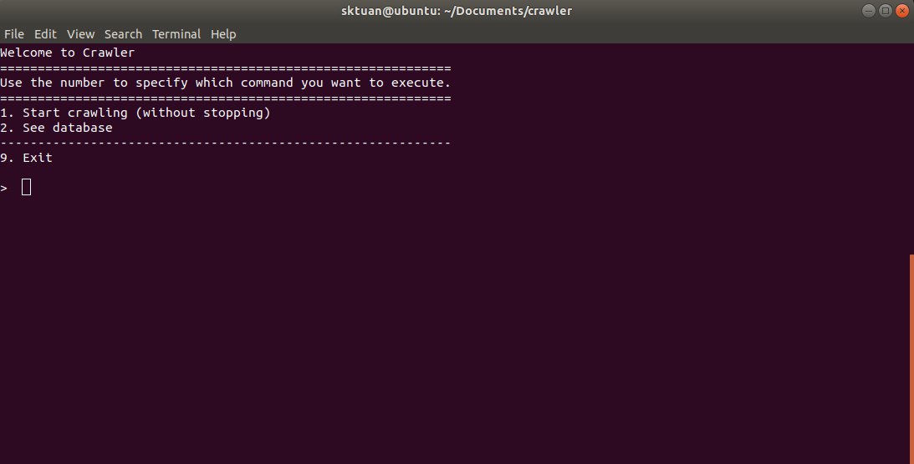
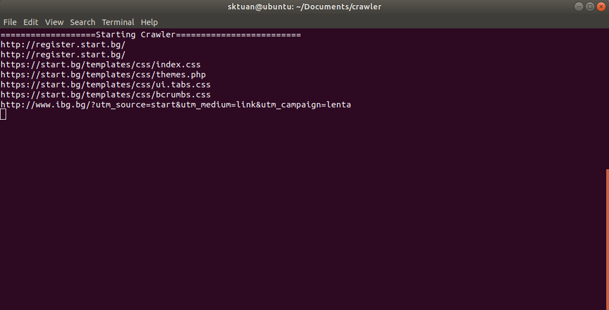

# Crawler

**Histogram of the server software that runs bulgarian webpages (that end in .bg)**

## Contents
- [About](#about)
- [Version](#version)
- [Requirements](#requirements)
- [Usage](#usage)
- [FAQ](#faq)
- [DeveloperTeam](#developerteam)

## About
Crawler is a tool used to "crawl" through the pages of the Internet 
(more specifically Bulgarian webpages) and collect and store information 
about the sites it finds along its way.
So far Crawler only stores data about the server software that runs the 
page, but there's potential to do much more.

## Version
**Crawler v.2.0.0 (Current version)**

**Crawler v.1.0.0 (First version)**

## Requirements
- Linux-based OS
- Python3
- Packages found in the *requirements.txt* file

## Usage
After you've installed the packages, the running Crawler is pretty simple.

0. Navigate to the Crawler folder
1. Open a terminal in the directory 
   (or skip step 0 and navigate through the terminal)
2. Run *$ python main.py build*
   - This will create the *server.db* on your device.
3. Run *$ python main.py start*
   - This will start the Crawler application 

## FAQ
### Is there a way to stop the crawler after it's started?
Unfortunately Crawler does not have a stop option at this point,
but we're working on making stopping the application easier in
our next update.
For now, you'll have to use *ctrl+c* key combination if you want
to stop Crawler.

### Is there a way to change the name of the database where Crawler stores its information? 
At this point - no, but it's one of our main priorities for the next update.

### Can you stop Crawler and expect it to continue "crawling" from where you stopped it?
No. Crawler does not have any other memory besides the information it gathers and stores
about the visited sites in the current session.

## DeveloperTeam

[Tsvetomir](https://github.com/TsvetomirTsvetkov)
